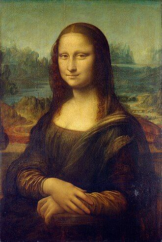
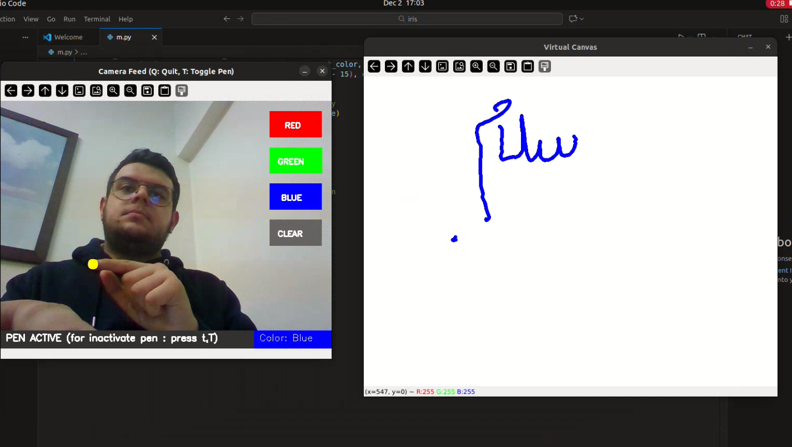

# Virtual-Painting✋



*Yes, someone actually drew this masterpiece... in the air... with one finger*

A real-time air drawing application using only your webcam and hand gestures.  
Draw anything (even Mona Lisa!) just by moving your finger in front of the camera.
## Features

- Draw freely in the air using index finger tracking
- Pinch gesture (thumb + index) to click virtual buttons
- Color selection: Red, Green, Blue
- Clear canvas button
- Toggle pen ON/OFF with **T** key
- Adjustable brush thickness with **+** and **-** keys
- Visual feedback: yellow hover, green flash on button press
- Clean virtual canvas window

## Installation & Run

```bash
# Clone the repository
git clone https://github.com/your-username/virtual-air-canvas.git
cd virtual-air-canvas

# Create virtual environment (recommended)
python -m venv venv
source venv/bin/activate        # On Windows: venv\Scripts\activate

# Install dependencies
pip install -r requirements.txt

# Run the app
python main.py

```


## Controls

### Keyboard
| Key       | Action                          |
|-----------|---------------------------------|
| `T` / `t` | Toggle drawing mode (Pen ON/OFF) |
| `+`       | Increase brush thickness        |
| `-`       | Decrease brush thickness        |
| `Q` / `q` | Quit the application            |

### Hand Gestures
- **Pinch** (bring thumb + index finger close) → Click virtual buttons  
- Move index finger while pen is **active** → Draw on the canvas

## Dependencies

Listed in `requirements.txt`:

- `opencv-python`
- `mediapipe`
- `numpy`

## How It Works

- MediaPipe Hands detects hand landmarks in real-time
- Distance between thumb and index fingertip detects the **pinch** gesture
- Index fingertip position is used as the drawing cursor
- Virtual buttons are placed on the right side of the camera feed
- All drawing is rendered on a separate persistent canvas window

## Look, Ma — No Hands on Screen!



*100% real. 0% mouse. 1 finger. Infinite artistic confidence.*

---

## Future Ideas (Contributions Welcome!)

- Add eraser mode
- Multiple brush styles (marker, spray, etc.)
- Save drawings to image file
- Advanced color picker using palm or other gestures
- Undo/Redo functionality

---

## ✨ Author

**Sepehr Pouladi**  
📍 Tehran, Iran  
🎓 Mechanical Engineering Student at IUST| Computer Vision & AI Enthusiast  
🔗 [LinkedIn](https://www.linkedin.com/in/sepehrpooladi84/)
🔗[Gmail](sepehrpooladi84@gmail.com)

---

Made with Python, OpenCV, MediaPipe, and zero artistic talent (but lots of enthusiasm).

See you in the stars!

